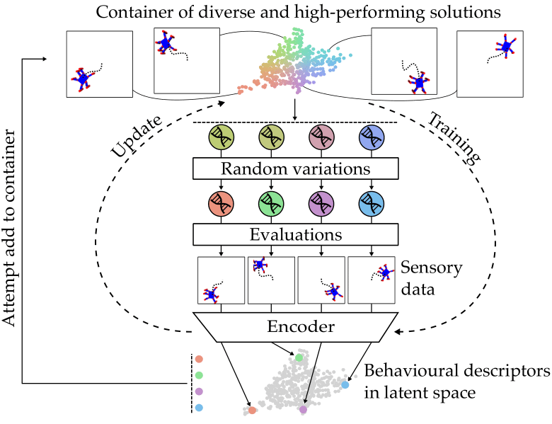
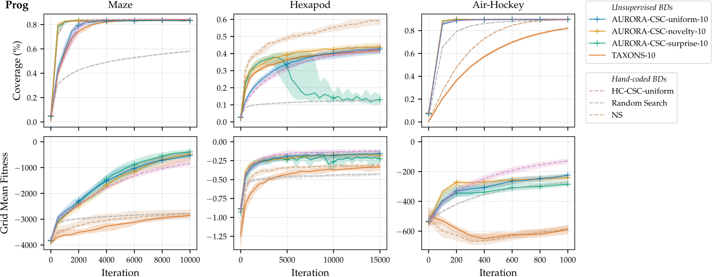
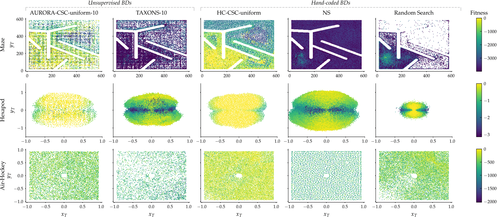

# Unsupervised Behaviour Discovery with Quality-Diversity Optimisation

This repository presents the official implementation of [Unsupervised Behaviour Discovery with Quality-Diversity Optimisation](https://arxiv.org/abs/2030.12345).
In particular, this repository contains the implementation of the introduced algorithm: _AUtonomous RObots Realising their Abilities (AURORA)_.

The purpose of AURORA is to learn a container of diverse and high-performing behaviours, while automatically learning how to define relevant Behavioural Descriptors (BDs).
Those BDs result from an encoding of the sensory data collected by the agent.

More precisely, AURORA alternates between:
- a _Quality-Diversity phase_ (plain arrows in diagram below).
  The purpose of that phase is to maximise the quality and the diversity of the container of solutions.
  At each iteration:
  1. Solutions are selected from the container
  2. Those solutions are copied, and those copies undergo mutations and cross-overs.
  3. We evaluate those new solutions and collect their sensory data.
  4. We encode that sensory data into low-dimensional BDs.
  5. If the performance and/or novelty of the new solutions are high-enough, we add them to the container.
- an _encoder update phase_ (dashed arrows in diagram below).
  The purpose of that phase is to learn appropriate BDs from the sensory data collected by the solutions.
  During an encoder update:
  1. All the sensory data from the container is used to train the encoder.
  2. Once the encoder has been trained, all the BDs are recomputed with the up-to-date encoder.

<p align="center">

</p>

## Requirements

All the dependencies (with pre-built experiments) are already installed in the [following singularity container]().

In particular, the following C++ libraries are installed in that container:

- For all tasks:
  - [sferes2](https://github.com/sferes2/sferes2/) - Lightweight C++ framework for evolutionary computation.
    Most of our code follows the [Quality-Diversity framework](https://ieeexplore.ieee.org/document/7959075) implemented on the [qd branch](https://github.com/sferes2/sferes2/tree/qd)
  - [PyTorch C++ frontend](https://pytorch.org/cppdocs/frontend.html) - For implementing the diverse models of Auto-Encoders (for performing the dimensionality reduction present in AURORA and TAXONS).
- For the Hexapod task:
  - [Dynamic Animation and Robotics Toolkit (DART)](https://dartsim.github.io/) - 3D physics engine.
  - [RobotDART](https://github.com/resibots/robot_dart) - A wrapper around DART for robotic-oriented environments.
- For the Maze task:
  - [libfastsim](https://github.com/jbmouret/libfastsim) - sferes2 module for simulating a wheeled robot in a maze.
  - [nn2](https://github.com/sferes2/nn2) - sferes2 module for performing neuro-evolution on neural-network controllers. 
  Those controllers are the ones used the wheeled robot in libfastsim.
- For the Air-Hockey task:
  - [Box2D](https://github.com/erincatto/box2d) - 2D physics engine.
  - [RoBox2D](https://github.com/adaptive-intelligent-robotics/RoBox2D) - A wrapper around Box2D, following the same structure as RobotDART.

The analysis is performed in Python 3.8, all the libraries used are in the [requirements.txt](requirements.txt) file.
They can be installed via the following command (if launched from outside of the container):
```bash
pip3 install -r requirements.txt
```

## Available Experiments

### Experiment class

Each experiment is described via an [Experiment object](../singularity/experiment.py).

Its main attributes are:
- `algo` Name of the algorithm to consider.
  The main values for that variable are:
  - For AURORA (AURORA-CSC by default):
    - `aurora_uniform` - AURORA with a uniform selector
    - `aurora_novelty` - AURORA with a novelty selector
    - `aurora_surprise` - AURORA with a surprise selector (the surprise score corresponds to the error of reconstruction by the encoder)
    - `aurora_nov_sur` - AURORA mixing a novelty (50%) and surprise (50%) selectors
    - `aurora_curiosity` - AURORA with a curiosity selector
  - For TAXONS:
    - `taxons` - TAXONS (using a selection procedure based on Novelty and Surprise) as described in [Unsupervised Learning and Exploration of Reachable Outcome Space](https://ieeexplore.ieee.org/document/9196819) (Paolo et al., 2020)
    - `taxo_n` - TAXO_N (using a selection only based on Novelty) as described in (Paolo et al., 2020)
    - `taxo_s` - TAXO_S (using a selection only based on Surprise) as described in (Paolo et al., 2020)
  - For the Hand-coded baselines:
    - `hand_coded_qd` - Hand-Coded QD algorithm using an unstructured archive with 2-dimensional hand-coded behavioural descriptors, and a uniform selector
    - `hand_coded_qd_no_sel` - Hand-Coded QD algorithm without any selector (new individuals are generated randomly). This is equivalent to random search.
    - `hand_coded_taxons` - Equivalent to Novelty Search, as described in [Novelty Search makes Evolvability Inevitable](https://dl.acm.org/doi/10.1145/3377930.3389840) (Doncieux et al., 2020)
- `env` Name of the environment/task to consider. The main values for that variable are:
  - `hard_maze` - Maze task
  - `hexa_cam_vertical` - Hexapod task
  - `air_hockey` - Air-Hockey task
- `latent_space` - Number of dimensions of the Behavioural Descriptor.
  In the case of AURORA and TAXONS, it corresponds to the number of dimensions of the latent space.
- `use_volume_adaptive_threshold` (set to `False` by default) 
  - If `False`, the AURORA experiments use the Container Size Control technique (CSC).
  - If `True`, the AURORA experiments use the Volume Adaptive Threshold technique (VAT). 

The complete descriptions of its attributes are provided in [the Experiment documentation file](docs/doc_experiment_class.md).

### Collections of Experiments

The experiments are organised into collections in the [collections_experiments folder](singularity/collections_experiments/).
Each collection file presents at its end a list `LIST_EXPERIMENTS` containing all the experiments that are built.

### Executables

Our container presents one executable per experiment (i.e. per `Experiment` object).
The names of all our executables are provided [in this csv file](docs/all_experiments.csv).

## Launching an experiment

Given an executable name (see above), you can launch an experiment using the following command:

```bash
TMP_SING_DIR=$(mktemp -d -p "$(pwd)" tmp.XXXXX)
singularity run --no-home --containall --bind <folder_for_saving_results>:/home/results/ --workdir "${TMP_SING_DIR}" --pwd /home/results/  <container.sif> <name_executable> --number-threads <number_threads>
```
where:
- `<folder_for_saving_results>` is the absolute path to the folder where the results should be saved
- `<container.sif>` refers to the singularity container.
- `<name_executable>` is the name of the executable as presented in the above tables.
- `<number_threads>` corresponds to the total number of threads (mostly for parallel evaluations of individuals in the evolutionary algorithm).

## Analysis

### Launching an Analysis

To launch an analysis from the data generated by one or several experiments, you can launch the following command:

```bash
singularity run --no-home --containall --bind <folder_for_saving_results> --bind "$(pwd)":/home/results/ --workdir "${TMP_SING_DIR}" --pwd /home/results/  --app analysis <container.sif> <folder_for_saving_results> <number_processes>
```
where `<number_processes>` is the number of parallel processes used to read the data results (set to `30` by default).

This creates a folder `results/` inside your analysis folder, which contains:
- pandas dataframes summarising the quantitative information resulting from the data (coverages per generation, mean fitness, ...)
- per-experiment result folders presenting: 
  - evolution of diverse metrics (with one curve per run), including coverage, mean fitness, average novelty score, evolution of l value (distance threshold of the container d_{min})
  - gif files showing the evolution of the archive over time
  - html files presenting the BDs of the archive at some specific generations
- other folders with diverse comparisons between several variants. 
  The details of those comparisons are provided in [the configuration analysis file](analysis/configuration_analysis.py).

### Obtained analysis plots

The main analysis plots obtained from the above command are available [here](https://drive.google.com/drive/folders/1LLVgItOE2p1zeTGnXS2kcrNxrZcA0Ugj?usp=sharing).
Those plots are made to perform some raw analysis of the results for each run of each experiment.

## Main Results

We tested AURORA-CSC (AURORA with Container Size Control) with various QD selectors:
- a uniform selector
- a novelty-based selector
- a surprise-based selector (selecting in priority the individuals presenting the highest reconstruction error from the Auto-Encoder)

*Note*: The name of an AURORA variant is formatted in the following manner:
```
AURORA-CSC-<selector_name>-<latent_space_dimensionality>
```

We also compared AURORA-CSC with:
- Another unsupervised Quality-Diversity (QD) algorithm: [TAXONS](https://ieeexplore.ieee.org/document/9196819) (Paolo et al., 2020)
- Several other Hand-Coded QD algorithms, having access to an hand-coded low-dimensional Behavioural Descriptor (BD):
    - *HC-CSC-Uniform* - QD algorithm using an unstructured container with Container Size Control (CSC), with a uniform selector, and hand-coded BDs
    - *Novelty Search (NS)* - Evolving a population to be novel with respect to an archive. 
      At each step, some individuals of the population are added to the archive (in our case, we add the 5 most novel individuals).
      Our implementation of NS follows its description from [Novelty Search makes Evolvability Inevitable](https://dl.acm.org/doi/10.1145/3377930.3389840) (Doncieux et al., 2020)
    - *Random Search* - QD algorithm using an unstructured container, but that does not select any individual from the container.
  In other words, new individuals are generated by sampling uniformly in the genotype space.

### Quantitative comparison between AURORA-CSC and its variants

<p align="center">

</p>


### Examples of final containers

<p align="center">

</p>

### Re-generating all paper results

```bash
singularity run --no-home --containall --bind <folder_for_all_results_paper> --bind "$(pwd)":/home/results/ --pwd /home/results/  --app analysis <container.sif> <folder_for_all_results_paper>
```
where:
- `<folder_for_all_results_paper>` is the folder containing all the generated paper results.

All the pre-processed data for generating those results are provided in the singularity container, inside the `/git/sferes2/exp/aurora/analysis/paper/` folder.

## Main structure

- `cpp/` - Contains all the source code (in C++) for the experiments.
  See the [README.md in the `cpp/`](./cpp/README.md) folder for more details.
- `singularity/` - Contains all the scripts for building the container, and for choosing the appropriate hyper-parameters for each experiment
    - `experiment.py` - Defines the `Experiment` class used to describe each experiment/executable
    - `collections_experiments/` - Provides the definitions of the `Experiment` objects for each task
- `analysis/`
   - `metrics/` - Defining all the metrics for each experiment (such as coverage, grid-based fitness...)
   - `analysis_runner.py` - Main analysis script, generating graphs from raw data for quick analysis
   - `paper/` - Scripts for generating the figures present in the paper.
       - `dataframe_preprocessor.py` - used to preprocess the task-specific dataframes (e.g. `df_maze.csv`), and combine them.
       - `generate_all_results_paper.py` - used to generate all the figures present in the paper submission.
